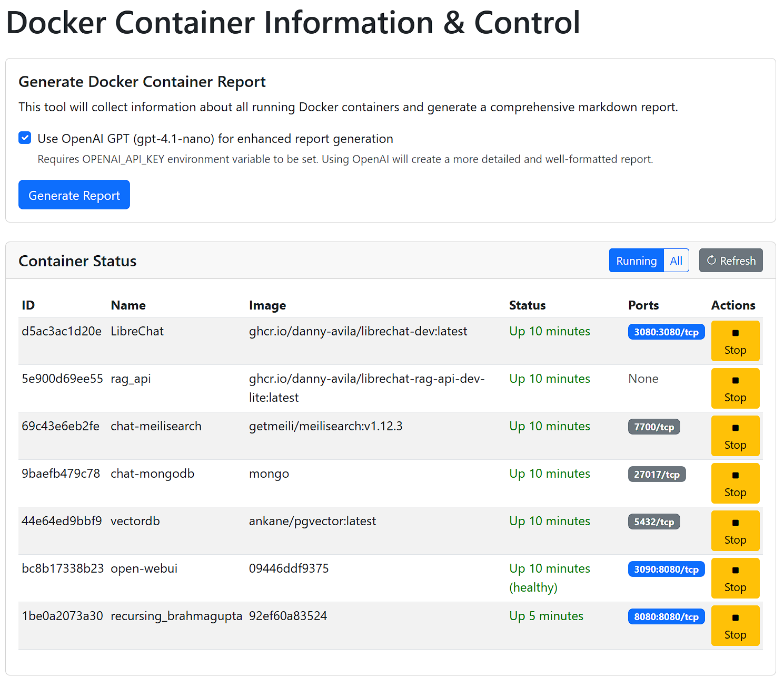

# Docker Container Information & Control Tool

A web application built with Flask that collects information about running Docker containers, generates comprehensive markdown reports, and provides basic container management capabilities.



## Features

-   **Container Status:** Displays a live table of running or all Docker containers on the main page.
    -   Shows container ID, Name, Image, Status, and mapped Ports.
    -   Provides clickable links for mapped ports to open them in the browser.
    -   Allows refreshing the container list.
    -   Includes buttons to Start/Stop containers directly from the interface.
-   **Report Generation:**
    -   Collects detailed information about all running Docker containers using `docker inspect`.
    -   Generates a basic markdown report summarizing container details (name, image, status, ports, networks, volumes, environment variables, resource limits).
    -   Identifies and groups containers belonging to the same Docker Compose project.
    -   Optionally uses OpenAI's `gpt-4.1-nano` model (if API key is provided) to generate a more detailed and structured AI-enhanced report, appended to the basic report.
-   **Web Interface:**
    -   Provides a web interface to trigger report generation, view task status, download, and view the generated report(s).
-   **API:** Includes API endpoints for status checking and container management.

## Setup

1.  **Prerequisites:**
    *   Python 3.x
    *   Docker installed and running.
    *   (Optional) OpenAI API Key for enhanced reports.

2.  **Clone the repository:**
    ```bash
    git clone <your-repository-url>
    cd <repository-directory>
    ```

3.  **Install dependencies:**
    ```bash
    pip install -r requirements.txt
    ```
4.  **(Optional) Set OpenAI API Key:**
    For enhanced report generation using OpenAI, set the `OPENAI_API_KEY` environment variable:
    ```bash
    export OPENAI_API_KEY='your-api-key-here' 
    ```
    *Note: On Windows, use `set OPENAI_API_KEY=your-api-key-here` or set it via system properties.*

## Usage

1.  **Run the Flask application:**
    ```bash
    python app.py
    ```
    The application will start on `http://127.0.0.1:5000` by default.

2.  **Access the web interface:**
    Open your web browser and navigate to `http://127.0.0.1:5010` (or the port specified when running).

3.  **View Container Status:**
    *   The main page displays a table of currently running containers.
    *   Use the "Running" / "All" toggle to switch views.
    *   Click the "Refresh" button to update the list.
    *   Click the "Start" or "Stop" buttons to manage individual containers.
    *   Click on mapped port badges (e.g., `8080:80/tcp`) to open the host port in your browser.

4.  **Generate a report:**
    *   In the "Generate Docker Container Report" section, click the "Generate Report" button.
    *   Optionally, check the "Use OpenAI GPT" box if you have set your API key and want an enhanced report.
    *   You will be redirected to a status page.

5.  **View/Download the report:**
    *   Once the report generation is complete, the status page will provide buttons to "Download Report" or "View Report" directly in the browser.

## API Endpoints

-   `/`: Main page displaying container status and report generation form.
-   `/generate` (POST): Starts the report generation task.
-   `/status/<task_id>`: HTML page showing the status of a specific report generation task.
-   `/api/status/<task_id>`: JSON endpoint to get the status of a specific report generation task.
-   `/download/<task_id>`: Downloads the generated markdown report for a completed task.
-   `/view/<task_id>`: Displays the generated markdown report in the browser for a completed task.
-   `/api/containers` (GET): Returns a JSON list of containers (use `?all=true` for all containers).
-   `/api/container/<action>/<container_id>` (POST): Performs an action (`start` or `stop`) on a specific container.

## Project Structure

```
.
├── app.py             # Main Flask application logic
├── requirements.txt   # Python dependencies
├── templates/         # HTML templates
│   ├── index.html     # Main page template
│   ├── status.html    # Task status page template
│   └── view.html      # Report view page template
└── README.md          # This file
```
